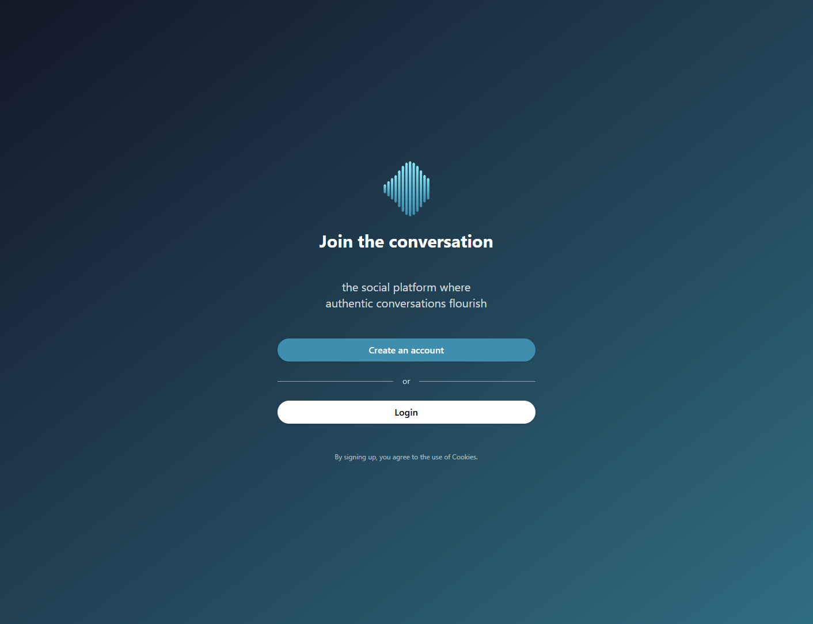

<!-- HEADER -->
 

  

  <h1>Echo</h1>
  <h3><i>The social platform where authentic conversations flourish</i></h3>
  

    <a href="./docs/architecture.md">Architecture</a> •
    <a href="./docs/clerk.md">Clerk Setup</a> •
    <a href="./docs/client.md">Client Docs</a> •
    <a href="./docs/api.md">API Docs</a>
  

## 🖼️ Showcase

## 📜 Introduction

WIP

## 📚 Documentation

- [System Architecture](./docs/architecture.md)
- [Clerk Setup Guide](./docs/clerk.md)
- [Client Documentation](./docs/client.md)
- [API Documenation](./docs/api.md)

---

<!-- FOOTER -->

  <a href="#top">back to the top</a>

