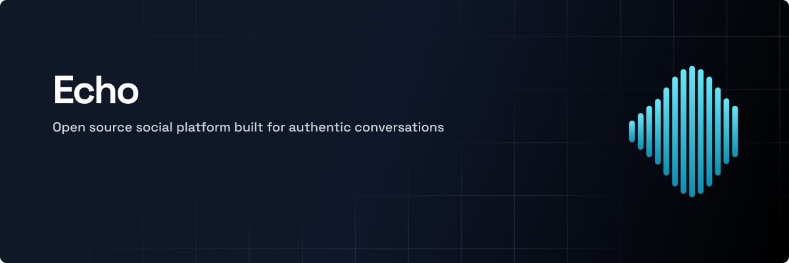

<!-- HEADER -->
 

  

  

    <a href="./docs/architecture.md">Architecture</a>
    &nbsp;&nbsp;•&nbsp;&nbsp;
    <a href="./DEVELOPMENT.md">Development</a>
    &nbsp;&nbsp;•&nbsp;&nbsp;
    <a href="./client/">Web Client</a>
    &nbsp;&nbsp;•&nbsp;&nbsp;
    <a href="./api/">REST Service</a>
  

## 🖼️ Showcase

WIP

## 📜 Introduction

WIP

## 📚 Documentation

WIP

---

<!-- FOOTER -->

  <a href="#top">back to the top</a>

