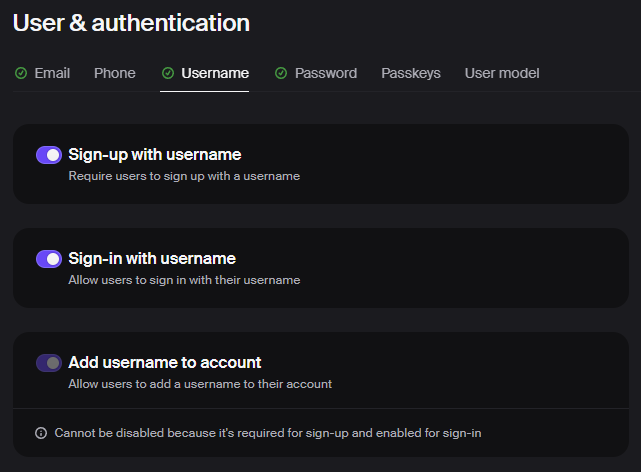
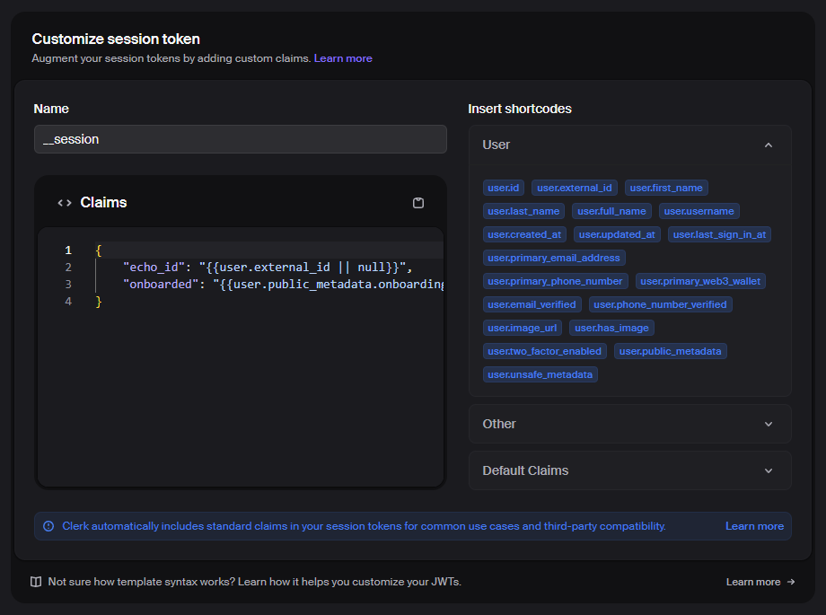
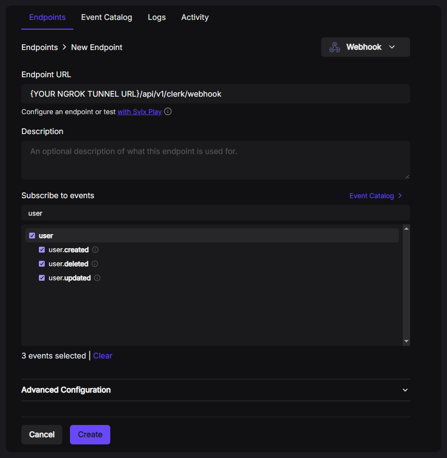
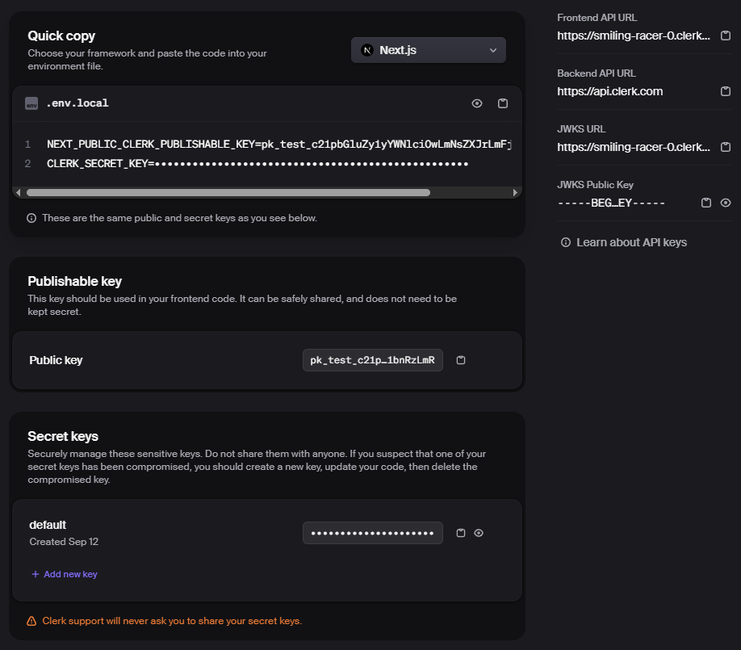

<!-- HEADER -->
<br id="top" />
<p align="center">
  <a href="https://clerk.com" target="_blank" rel="noopener noreferrer">
    <picture>
      <source srcset="https://images.clerk.com/static/logo-dark-mode-400x400.png">
      
    </picture>
  </a>
</p>
<h1 align="center">Clerk setup</h1>

The Echo applications are protected with Clerk authentication. Without a correctly configured Clerk application, you won't be able to boot local instances of the React client or Spring Boot REST API.

This documentation contains instructions for validating that the Clerk application is correctly configured to the repository's needs, and for obtaining the required keys to spin up the applications on your local machine.

> [!IMPORTANT]
> The Clerk dashboard UI is subject to change and the below instructions may no longer be fully accurate in the future, but the relevant settings should still be easy to find.

## Table of contents

- [Creating a Clerk application](#creating-a-clerk-application)
  - [Requiring usernames at sign-up](#requiring-usernames-at-sign-up)
  - [Adding custom session token claims](#adding-custom-session-token-claims)
  - [Configuring user event webhooks](#configuring-user-event-webhooks)
- [Obtaining the API keys](#obtaining-the-api-keys)
- [Optional: local integration testing](#optional-local-integration-testing)

## Creating a Clerk application

To run the applications locally, you need to create a Clerk application.

1. Sign up for a [Clerk](https://clerk.com) account if you do not already have one
2. Navigate to the [Clerk dashboard](https://dashboard.clerk.com/apps) and create a new application

### Requiring usernames at sign-up

> [!CAUTION]
> If the Clerk application is not configured to require usernames on sign-up, the user registration flow will fail at the API.

1. Head to the **Configure** tab within your newly created Clerk application
2. Head to the **User & authentication &rarr; Username** section
3. Check **Sign-up with username** to ensure a username is required at the point of registration

<br />


### Adding custom session token claims

> [!CAUTION]
> If the Clerk application is not configured to include the required custom claims on the bearer tokens, all authenticated HTTP requests sent to the REST API will return 403 Forbidden.

1. Head to the **Configure** tab within your newly created Clerk application
2. Head to the **Session management &rarr; Sessions** section
3. Customise the session token with the following JSON template

<br />

```
{
	"echo_id": "{{user.external_id || null}}",
	"onboarded": "{{user.public_metadata.onboardingComplete || false}}"
}
```



### Configuring user event webhooks

> [!IMPORTANT]  
> You will require a tunneling service to expose your localhost port to the web. [Ngrok is the recommended option by Clerk](https://clerk.com/docs/webhooks/sync-data), but you may use any tunneling service of your choice.

1. Spin up a tunnel pointing to `localhost:8080`, or the port the REST API will run on if you changed it from the default
2. Head to the **Configure** tab within your newly created Clerk application
3. Head to the **Developers &rarr; Webhooks** section
4. Add a new endpoint, set the **Webhook URL**, subscribe to all **user** events, then create
5. Locate your **Signing Secret** from the endpoint panel once created &rarr; This is your **CLERK_WEBHOOK_SIGNING_SECRET**

<br />

```
{YOUR_TUNNEL_URL}/api/v1/clerk/webhook
```



<p align="right">
  <sub><a href="#top">back to the top</a></sub>
</p>

## Obtaining the API keys

1. Head to the **Configure** tab within your newly created Clerk application
2. Head to the **Developers &rarr; API Keys** section

For the React Web Client, you will need:

- The **Publishable Key** &rarr; This is your **VITE_CLERK_PUBLISHABLE_KEY**

For the Spring Boot REST API, you will need:

- A **Secret Key** &rarr; This is your **CLERK_SECRET_KEY**
- The **Frontend API URL** &rarr; This is your **CLERK_ISSUER_URI**
- The **JWKS URL** &rarr; This is your **CLERK_JWK_SET_URI**
- The **Webhook Signing Secret** located as described [here](#configuring-user-event-webhooks)

<br />


<p align="right">
  <sub><a href="#top">back to the top</a></sub>
</p>

## Optional: local integration testing

As of **Sept. 2025**, Clerk does not currently support testing environments within the same Clerk application. The current workaround to run local integration tests is to create **a second identical Clerk application** (e.g., append the application name with **CI/CD** for clarity).

Create the following JWT templates exactly in the CI/CD application. These templates simulate malformed or missing bearer token claims to test failure cases in the Spring Security filter chain.

```
Name: malformed-echo_id-claim
Token lifetime: 3600

{
	"echo_id": "not_a_valid_UUID",
	"onboarded": true
}
```

```
Name: malformed-onboarded-claim
Token lifetime: 3600

{
	"echo_id": "{{user.external_id || null}}",
	"onboarded": "not_a_valid_boolean"
}
```

```
Name: missing-echo_id-claim
Token lifetime: 3600

{
	"onboarded": "{{user.public_metadata.onboardingComplete || false}}"
}
```

```
Name: missing-onboarded-claim
Token lifetime: 3600

{
	"echo_id": "{{user.external_id || null}}"
}
```

---

<!-- FOOTER -->
<p align="center">
  <sub><a href="#top">back to the top</a></sub>
</p>